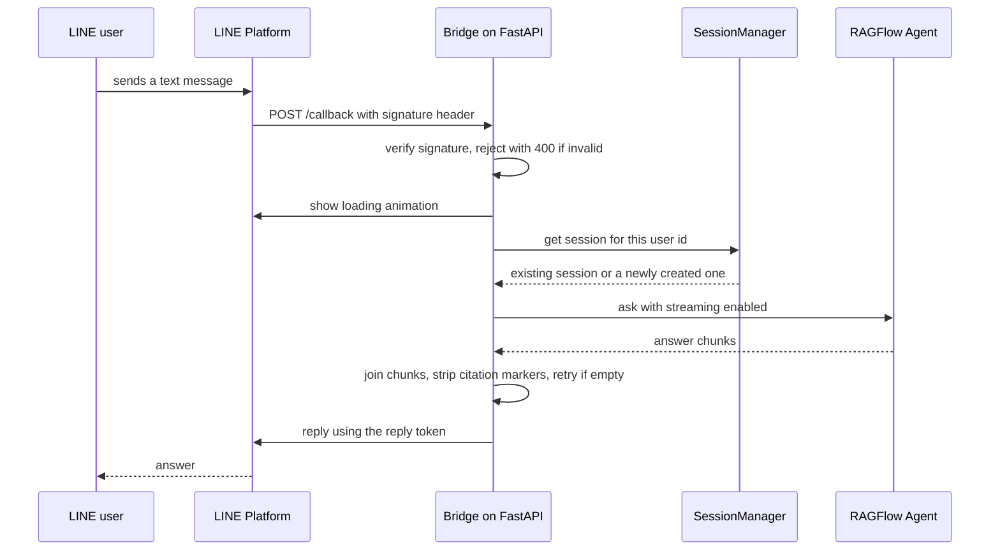
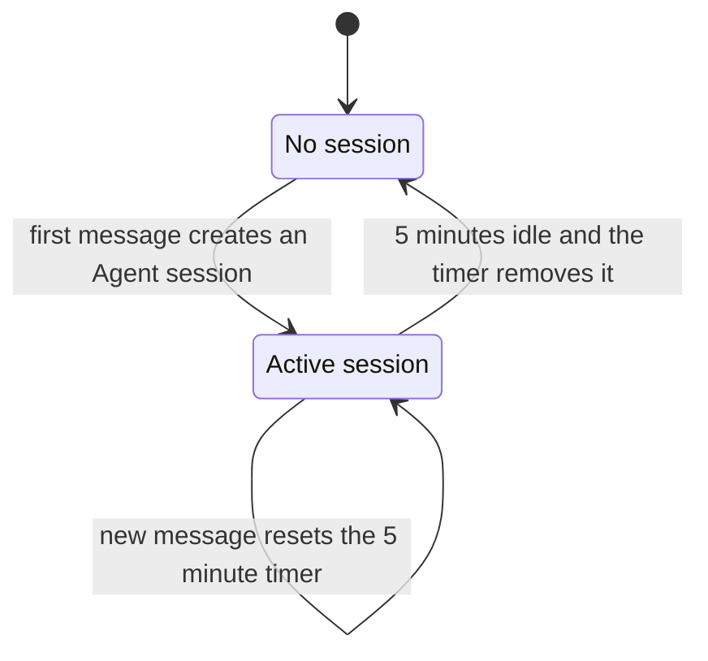

# ragflow-linebot-bridge

**English** | [繁體中文](README.zh-TW.md)

A small bridge service that puts any [RAGFlow](https://github.com/infiniflow/ragflow) Agent behind a LINE Official Account, so people can query a knowledge base from the chat app they already use.

It is deliberately small: three Python modules, five environment variables, one `docker compose up`.



## The problem

RAGFlow lets you build a retrieval-augmented Agent and talk to it through its own web UI or its API. That is fine for whoever built the Agent, but not for everyone else, who would rather ask a question in a chat app than open another site.

Connecting the two is mostly glue, but the glue has to get three things right:

- **Conversation state.** A LINE webhook event is stateless; a RAGFlow Agent conversation lives in a session. Something has to map one to the other, per user.
- **Response clean-up.** The Agent's raw output is a stream of cumulative chunks with inline citation markers, and it occasionally comes back empty. None of that should reach the user.
- **LINE's webhook contract.** Signed requests, a reply token, and a user who is staring at the chat while the model thinks.

This project was used for internal quick Q&A over a knowledge base in a school lab.

## What it does

### One conversation per user, recycled when idle

[`app/session_manager.py`](app/session_manager.py) keeps a process-wide map from LINE user id to RAGFlow Agent session. The first message from a user creates a session; later messages reuse it, so follow-up questions keep their context. Every access resets a five-minute `threading.Timer`; when it fires, the session is dropped and the next message starts a fresh conversation.



### Handling what the model actually returns

[`app/ragflow_service.py`](app/ragflow_service.py) sits between the webhook and the RAGFlow SDK:

- **Streaming.** The SDK yields the answer-so-far on every chunk. The service appends only the new tail of each chunk, then returns the complete text. An early version truncated long answers; that was removed so the full response is always sent.
- **Citation markers.** RAGFlow embeds references as `##0$$`, `##1$$`, and so on. They mean nothing in a chat bubble, so they are stripped with a regular expression.
- **Retries.** If the call raises or the answer comes back empty, the service waits one second and asks again, up to five attempts.

These were not designed up front. The commit history shows them arriving over about a month: session expiry on day one, citation stripping a few weeks later, retries after that.

### Small enough to deploy in a few minutes

[`app/line_service.py`](app/line_service.py) is a single FastAPI endpoint, `POST /callback`. It verifies the `X-Line-Signature` header with the LINE SDK and returns 400 on a mismatch, triggers LINE's loading animation so the user sees that something is happening, and answers with the reply token. Configuration is entirely through environment variables, and the whole service runs as one container.

## Tech stack

| Piece | Version | Role |
|---|---|---|
| Python | 3.10 | Runtime (Docker base image) |
| FastAPI + Uvicorn | 0.115 / 0.34 | Webhook endpoint |
| line-bot-sdk | 3.16 (v3 API) | Signature check, loading animation, reply |
| ragflow-sdk | 0.17 | Agent sessions and streaming answers |
| Docker Compose | | Packaging and deployment |

## How it was built

I designed the structure: the split into a webhook layer, a RAGFlow service and a session manager, and how sessions are keyed and expired. Parts of the code were generated with ChatGPT and then integrated and corrected by me.

## Status

Written in March and April 2025 and not actively maintained since. Dependencies are pinned to the versions from that time; compatibility with newer RAGFlow releases has not been verified.

## Running it

You need Docker with the Compose plugin, a LINE Messaging API channel, and a reachable RAGFlow instance with an Agent already built.

```bash
git clone https://github.com/HsuehDev/ragflow-linebot-bridge.git
cd ragflow-linebot-bridge
cp .env.example .env
```

Fill in `.env`:

| Variable | Value |
|---|---|
| `LINE_CHANNEL_ACCESS_TOKEN` | Channel access token from the LINE Developers console |
| `LINE_CHANNEL_SECRET` | Channel secret from the same place |
| `RAGFLOW_API_KEY` | API key issued by your RAGFlow instance |
| `RAGFLOW_BASE_URL` | Base URL of RAGFlow including the port (its default API port is 9380) |
| `AGENT_ID` | Id of the Agent to talk to |

Start the service:

```bash
docker compose up --build -d
```

It listens on port 5050. LINE requires a public HTTPS webhook, so put it behind a reverse proxy or a tunnel such as ngrok, then set the webhook URL in the LINE Developers console to `https://<your-host>/callback`.

Stop it with `docker compose down`.

Never commit `.env`; it is already listed in `.gitignore`.

## License

[MIT](LICENSE)
