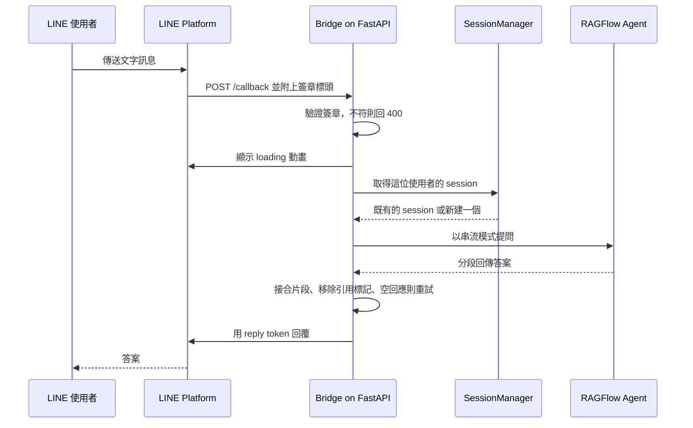
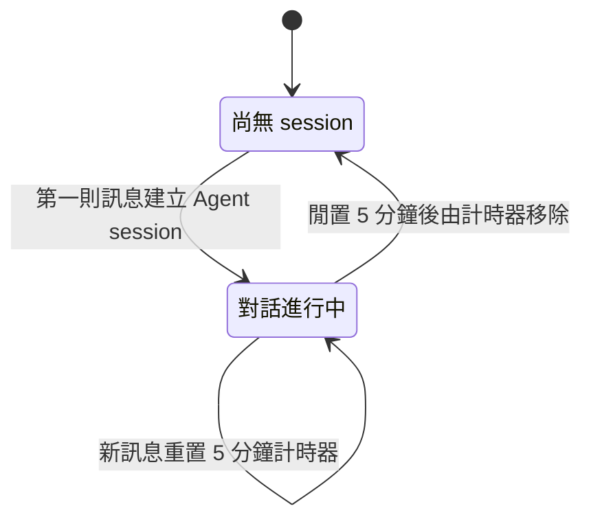

# ragflow-linebot-bridge

[English](README.md) | **繁體中文**

把任一個 [RAGFlow](https://github.com/infiniflow/ragflow) Agent 接到 LINE 官方帳號後面的輕量橋接服務，讓大家在平常就在用的聊天軟體裡直接查知識庫。

它刻意做得很小：三個 Python 模組、五個環境變數、一行 `docker compose up`。



## 要解決的問題

RAGFlow 可以建出一個檢索增強的 Agent，並透過它自己的網頁介面或 API 對話。對建 Agent 的人來說這樣就夠了，但對其他人不是——大家寧可在聊天軟體裡問一句，也不想再多開一個網站。

把兩邊接起來大多是膠水程式，但這層膠水有三件事得做對：

- **對話狀態。** LINE 的 webhook 事件是無狀態的，RAGFlow Agent 的對話則活在 session 裡，中間需要有人依使用者把兩者對應起來。
- **回應的後處理。** Agent 的原始輸出是一段段累積式的串流，夾著行內引用標記，偶爾還會回空字串。這些都不該讓使用者看到。
- **LINE 的 webhook 規範。** 要驗簽、要用 reply token 回覆，而且模型思考的時候，使用者正盯著聊天視窗等。

這個專案曾用於學校實驗室內部的知識快速問答。

## 它做了什麼

### 每位使用者一段對話，閒置就回收

[`app/session_manager.py`](app/session_manager.py) 在行程內維護一張「LINE user id → RAGFlow Agent session」的對應表。使用者的第一則訊息會建立 session，之後的訊息沿用同一個，所以追問時上下文還在。每次取用都會重置一個五分鐘的 `threading.Timer`；時間到就移除 session，下一則訊息會開啟新的對話。



### 處理模型實際回傳的東西

[`app/ragflow_service.py`](app/ragflow_service.py) 夾在 webhook 與 RAGFlow SDK 之間：

- **串流。** SDK 每個片段回傳的都是「到目前為止的完整答案」。服務只把每個片段新增的尾段接上去，最後回傳完整文字。早期版本會截斷過長的答案，後來拿掉了，改為一律回傳完整回應。
- **引用標記。** RAGFlow 會把參考來源以 `##0$$`、`##1$$` 這樣的形式嵌在文字裡。放在聊天泡泡裡沒有意義，所以用正規表示式移除。
- **重試。** 呼叫拋出例外或答案是空的，就等一秒再問一次，最多五次。

這些不是一開始就規劃好的。從 commit 紀錄可以看到它們在大約一個月內陸續加入：第一天就有 session 逾時回收，幾週後加上引用標記清理，再之後才是重試。

### 小到幾分鐘就能部署

[`app/line_service.py`](app/line_service.py) 只有一個 FastAPI 端點 `POST /callback`。它用 LINE SDK 驗證 `X-Line-Signature` 標頭，不符就回 400；接著觸發 LINE 的 loading 動畫，讓使用者知道有在處理；最後用 reply token 回覆。設定全部走環境變數，整個服務就是一個容器。

## 技術棧

| 項目 | 版本 | 用途 |
|---|---|---|
| Python | 3.10 | 執行環境（Docker 基礎映像） |
| FastAPI + Uvicorn | 0.115 / 0.34 | Webhook 端點 |
| line-bot-sdk | 3.16（v3 API） | 驗簽、loading 動畫、回覆訊息 |
| ragflow-sdk | 0.17 | Agent session 與串流回答 |
| Docker Compose | | 封裝與部署 |

## 怎麼做出來的

架構是我設計的：拆成 webhook 層、RAGFlow 服務與 session 管理三塊，以及 session 以什麼為鍵、怎麼過期。部分程式碼由 ChatGPT 協助產生，再由我整合與修正。

## 現況

2025 年 3 月到 4 月間完成，之後沒有持續維護。相依套件鎖在當時的版本，與較新版 RAGFlow 的相容性未經驗證。

## 如何執行

需要 Docker（含 Compose plugin）、一個 LINE Messaging API channel，以及一個連得到、且已建好 Agent 的 RAGFlow 實例。

```bash
git clone https://github.com/HsuehDev/ragflow-linebot-bridge.git
cd ragflow-linebot-bridge
cp .env.example .env
```

填寫 `.env`：

| 變數 | 內容 |
|---|---|
| `LINE_CHANNEL_ACCESS_TOKEN` | LINE Developers console 取得的 channel access token |
| `LINE_CHANNEL_SECRET` | 同一處取得的 channel secret |
| `RAGFLOW_API_KEY` | 你的 RAGFlow 實例核發的 API key |
| `RAGFLOW_BASE_URL` | RAGFlow 的 base URL，需包含 port（API 預設為 9380） |
| `AGENT_ID` | 要對話的 Agent id |

啟動服務：

```bash
docker compose up --build -d
```

服務監聽 5050 port。LINE 要求 webhook 必須是公開的 HTTPS 網址，所以請放在反向代理後面，或用 ngrok 這類通道工具，再到 LINE Developers console 把 webhook URL 設為 `https://<your-host>/callback`。

停止服務：`docker compose down`。

不要把 `.env` commit 進去；它已經列在 `.gitignore` 裡。

## 授權

[MIT](LICENSE)
